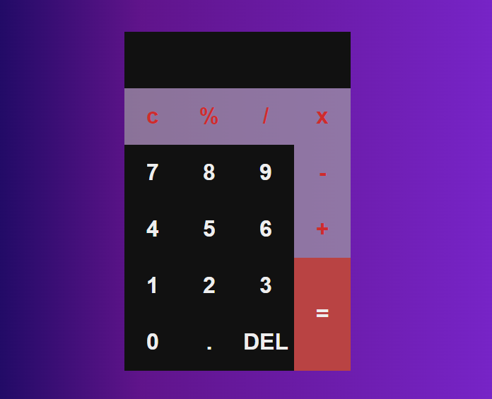

# CalculatorJS

Ao executar este projecto, voce podera enfrentar problemas de CORS (Cross-Origin Resource Sharing) e ocorre porque você está tentando carregar um módulo JS diretamente do sistema de arquivos (file://), o que é bloqueado pelos navegadores modernos devido a políticas de segurança.

##### Solucao:

Você precisa servir seus arquivos através de um servidor HTTP, uma das possibilidades eh instalando extensoes como o Live Server em seu VS-CODE e executar. Ou usar o NodeJS e o pacote  "http-server".

#### Imagem

